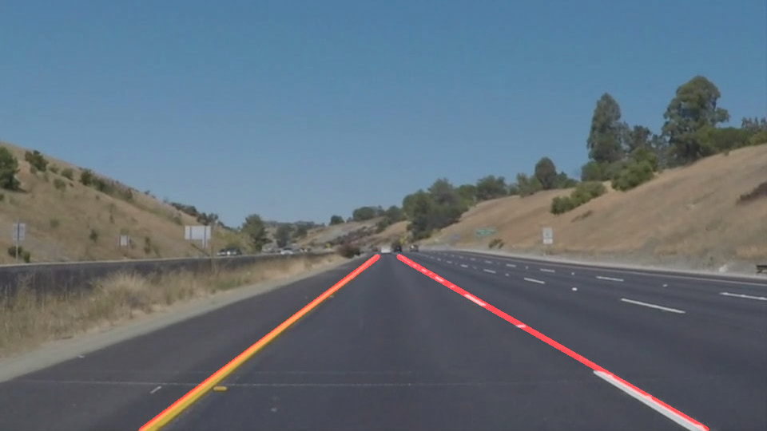

#**Finding Lane Lines on the Road**

##Writeup

---

**Finding Lane Lines on the Road**

The goals / steps of this project are the following:
* Make a pipeline that finds lane lines on the road
* Reflect on your work in a written report


[//]: # (Image References)

[image1]: ./examples/grayscale.jpg "Grayscale"

---

### Reflection

###1. Describe your pipeline

First I copied the code from P1.ipynb to a new file P1.py to get a familiar python environment.

Then I added a new function `find_lane_lines(original_image)` that should contain all the pipeline code. I added code
step by step and checked the results against the single test images.

####1. Convert to grayscale & blur

It's not gray, but it has only one color value per pixel:


####2. Apply Canny


####3. Only use region of interest

Here I made a mistake which I only figured out later: I didn't reuse the last result:


####4. Enlarge region of interest

I enlarged the region a little bit on the bottom right side:


####5. Get Hough lines & get weighted image

Now I began to wonder: Why is Hough detecting my whole region as lines?


I printed the weighted image, but so far no improvement:


####6. Fix mistake: variable unused

Then I used my unused variable and things started to look good!


####7. Smaller region of interest

I noticed that the horizon contains lines, which would be detected by the algorithm. So I fixed it by using a smaller
region of interest:


Now I could backport the code to Jupyter Notebook and create the videos!

####8. Improve `draw_lines()` method

Now I could improve the `draw_lines()` method. My first approach was
to simply split all the lines into two buckets (left/right) and then
take the average of those lines. This approach proved to be  problematic
with splitted lane lines.

After some attempts to solve the problem, I found the best way to print
the final lines was to collect the 2 line points of each line in a bucket
and get the min and max point for the whole collection. It's much easier
to understand in code:

```python
left_p1 = []
left_p2 = []
right_p1 = []
right_p2 = []

for line in lines:
    for x1,y1,x2,y2 in line:
        centerX = (x1 + x2) / 2
        # group into buckets left/right according to where lines are
        if (centerX < width / 2):
            left_p1.append((x1, y1))
            left_p2.append((x2, y2))
        else:
            right_p1.append((x1, y1))
            right_p2.append((x2, y2))

# print left lane line
if (len(left_p1) > 0 and len(left_p2) > 0):
    cv2.line(img, min(left_p1), max(left_p2), color, thickness)

# print right lane line
if (len(right_p1) > 0 and len(right_p2) > 0):
    cv2.line(img, min(right_p1), max(right_p2), color, thickness)
```

Finally, things started to look much better! And the videos look much nicer, too! :-)



###2. Potential shortcomings & possible improvements of my current pipeline

The current approach still has some shortcomings, some of which I could eliminate:

- Even if I used relative width/height percentages to define my region of interest,
the region will be hard-coded specifically to scenes where the car navigates straight.
Also, all the other values will be hard-coded to 
- My current approach of taking `min(leftPoint)` and `max(rightPoint)` is prone to
detect lines where no lane lines are. If a line is detected with points smaller or
larger than the other min/max points, those differences will fully be taken into account.
Instead, I could calculate the average (x,y) middle point and average slope and draw
a line over the full height of my region of interest.
- The algorithm does not really understand what lane lines are. It just detects rapid
changes in brightness via Canny and assumes them to be lanes. It does not get the concept
of a horizon, the border of the street, shadows or the border of my own car (as seen
in extra.mp4). A machine learning algorithm could learn what these things are and
differentiate between them - and it could really *learn* what lane lines are.
